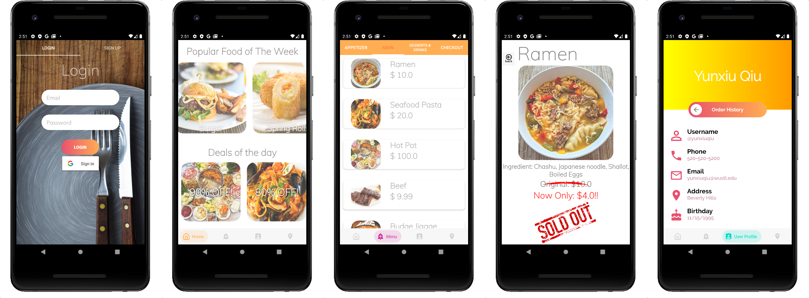

# Restaurant Management App

You can install this application from [Google Play Store](https://play.google.com/store/apps/details?id=com.restaurant.final_project).

## About

This is a generic restaurant ordering app as our class final project. The functionalities and features include:
1. A user login/signup interface using Firebase Authentication
2. A main interface featuring an easy-to-read bottom menu with sliding gesture control.
3. All menu item data(including availability) and restaurant info data are stored in a cloud-based database (Firebase Firestore) and they are highly scalable and can be updated in real-time.
4. An account info management page including ordering history for each individual account.
5. A dedicated restaurant information display page with branch selection and a map screenshot with google map API linked.

## Built With

1. Kotlin
2. XML
3. Android Architecture Components
   1. ViewModel
   2. ViewBinding
4. Google Map API
5. Google Authentication API
6. Firebase Firestore

## Contact

If you need any help, please contact me via yunxiuqiu@wustl.edu

